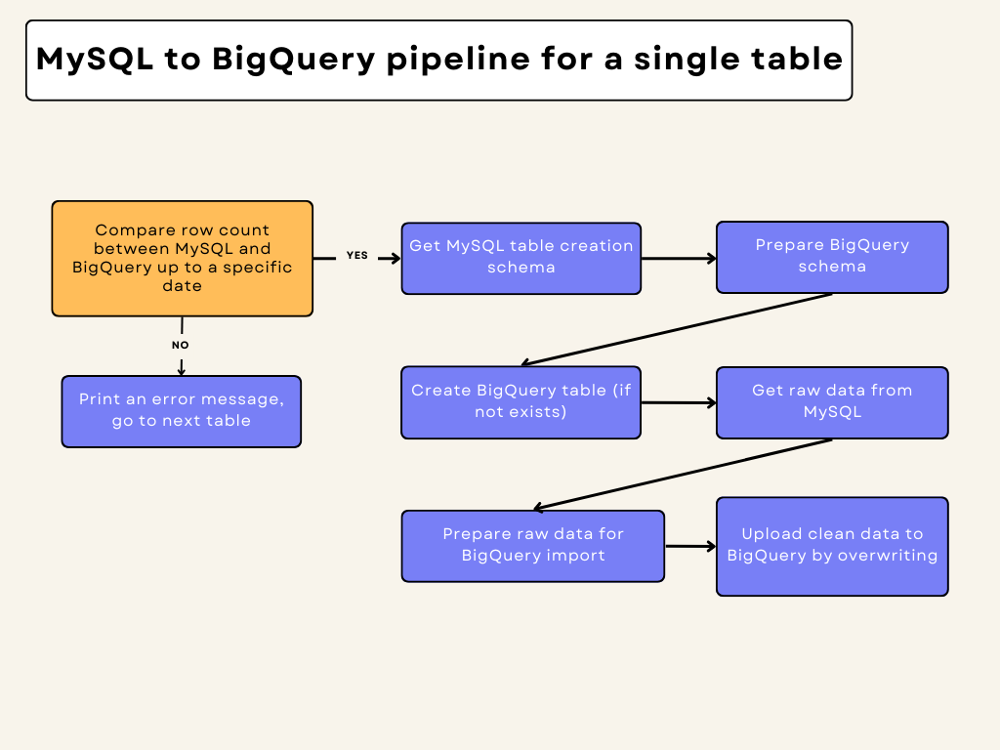
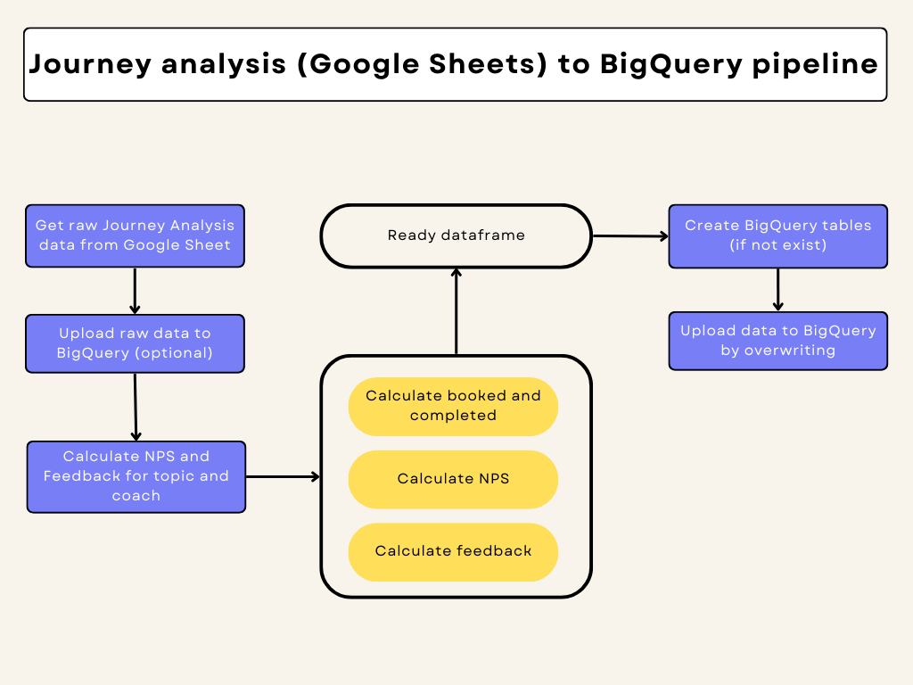

# SparrksAppDB_to_BigQuery_Pipelines
All tables from SparrksApp DB will be transferred to BigQury for data warehousing purposes

## MySQL to BigQuery Pipeline

The file *mysql_to_bigquery_pipeline.py* shows how to fetch data from MySQL and write it to
tables in BigQuery in the database **data-analytics-359712.sparrksapp_raw_data**.

Please consider the following graph for better understanding:

The pipeline works as follows:

* MySQL credentials are written in the file *db_config.py* and a connection is created
* BigQuery project and database id to which the data will be written are specified
* The BigQuery credentials are accessed through the same json file and a connection to the client is established
* In the main method a dae is specified, which will be used as a filter later
* Then all relevant table names are fetched from MySQL i a list (here table names for which the pipeline should be 
executed can be manually written in a list)
* Next, the pipeline is started for all tables in the given list. For each table:
  * the MySQL creation schema is fetched
  * it is transformed into a BigQuery schema
  * which is then used to create the BigQuery table (if not present already)
  * raw data is fetched from MySQL
  * the raw data is cleaned and prepared for BigQuery import by
    * handling special characters
    * handling empty strings
    * converting tinyint datatype to boolean datatype
    * converting time datatype to string datatype
    * corrupt rows are exported to a corrupt_rows_{timestamp}.csv file
  * after the cleaning is done, the data is uploaded to BigQuery

## Google Sheets to BigQuery Pipeline

### Google Sheet to Google Sheet through Python

The file *googlesheets_to_googlesheets.py* shows how to read and write data from Google Sheets to Google Sheets through Python

### Journey Analysis to BigQuery

The file *journey_analysis_to_bigquery.py* shows how to fetch the data from the Google 
Sheet document **Sparrks Analysis**, sheet **Journey Analysis**, calculates 
the NPS and writes the results to the tables in BigQuery in the database **data-analytics-359712.old_system_raw_data**.

Please consider the following graph for better understanding:

The pipeline works as follows:
    
* First, the service account is manually given access to the document **Sparrks Analysis** on Google Sheet
* Then, the credentials to access Google Sheets from Python are accessed through the json file what contains them
* Google Sheet document and sheet name from which the data is read are specified
* BigQuery project and database id to which the data will be written are specified
* The BigQuery credentials are accessed through the same json file and a connection to the client is established
* The BigQuery table names to write data to are specified
* Next, a list of relevant columns for the NPS calculations is specified (nps_columns). 
Only these columns will be taken into consideration
* A dictionary is initialized (reference_names), which will rename the column names from Google Sheet specific to 
BigQuery specific names
* In the main method, first the raw data is fetched from Google Sheets and processed to deliver only the relevant 
information for the NPS calculation with the correct column names to match the BigQuery schema
* Next, the raw data is written to BigQuery (optional)
* The NPS values for topic (use case) and coach are calculated respectively as follows:
  * First each column is calculated separately: booked, journey_completed, nps_power_coaching, nps_coach, feedback_n
  More information on how the calculations are done can be found in the file *journey_analysis_functions.py*
  * Then the data is merged together to create one single DataFrame with all relevant columns. The NaN values are replaced with 0
  * An extra column (origin) is appended at the end to specify the source of the data: OLD VERSION
* Finally, BigQuery tables for the topic and coach NPS calculations are created using predefined schemas 
(option to recreate existing tables)
* The data is uploaded to the BigQuery tables (option to overwrite or append data to the existing table)